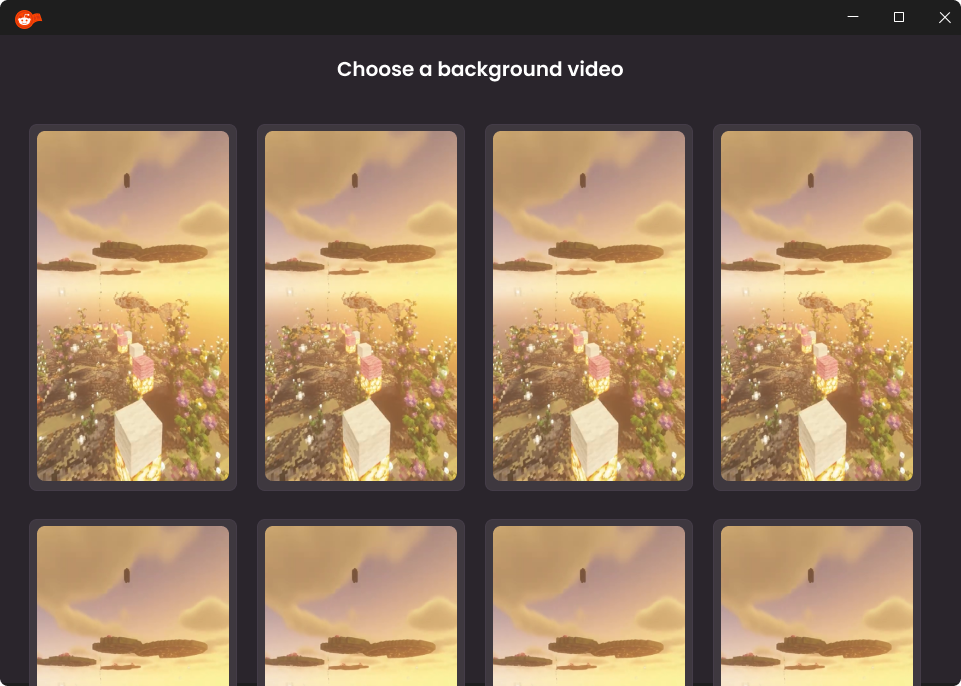

# AI Reddit Video Creator 🤖🎬

Transform Reddit threads or AI-generated stories into engaging videos complete with narration and subtitles! This project utilizes AI models to generate text-to-speech, create stories, produce subtitles, and combine everything with customizable background videos.

## ✨ Key Features

* **Reddit Content Fetching:** Paste a Reddit post URL to automatically extract the title and body text.
* **AI Story Generation:** Create original stories by specifying a theme and style, powered by Google's Gemma model (`google/gemma-2b-it`).
* **AI Narration (Text-to-Speech):** Convert text to speech using a variety of voices from the Kokoro model (`hexgrad/Kokoro-82M`).
* **Customizable Video Backgrounds:** Choose from a list of locally stored background videos or add your own to the `video_templates` folder.
* **Automatic Subtitle Generation (SRT):** Create subtitle files (`.srt`) from the generated audio using OpenAI Whisper. Allows limiting the maximum number of words per segment.
* **Subtitle Burning:** Embed subtitles directly into the final video.
* **Advanced Subtitle Customization:** Adjust font (from an extensive list of predefined fonts), size, text color, stroke color and thickness, background color, and position (top, center, bottom).
* **In-UI Preview:** See a live preview of how subtitles will look over a thumbnail of the selected background video, framed within a phone screen mock-up.
* **Intuitive Graphical User Interface:** User-friendly interface built with CustomTkinter.
* **File Management:** Generated files (audio, SRT, final videos) are automatically organized into subfolders within an `output` directory.

## 🛠️ Prerequisites

Before you begin, ensure you have the following:

1.  **Python:** Version 3.9 or higher is recommended (the project uses modern Python features and up-to-date libraries).
2.  **FFmpeg:** This is **crucial** for video and audio processing (used by MoviePy and Whisper).
    * Download it from [ffmpeg.org](https://ffmpeg.org/download.html).
    * Ensure the directory containing `ffmpeg.exe` (and `ffprobe.exe`) is added to your system's PATH.
3.  **(Optional but Recommended) NVIDIA GPU:** For faster AI story generation (Gemma) and Whisper transcription, an NVIDIA GPU with CUDA configured is recommended. The application will run on a CPU, but AI processes will be significantly slower.
4.  **Internet Connection:** Required for the initial download of AI models (Gemma, Kokoro, Whisper) if they are not already cached.

## 🚀 Installation and Running from Source

1.  **Clone the repository:**
    ```bash
    git clone [https://github.com/juliogmz89/ai-reddit-video-creator.git](https://github.com/juliogmz89/ai-reddit-video-creator.git)
    cd ai-reddit-video-creator
    ```

2.  **Create a virtual environment (recommended):**
    ```bash
    python -m venv venv
    # On Windows
    venv\Scripts\activate
    # On macOS/Linux
    source venv/bin/activate
    ```

3.  **Install dependencies:**
    Create a `requirements.txt` file in the root of your project with the following content:
    ```txt
    accelerate==1.7.0
    addict==2.4.0
    altgraph==0.17.4
    annotated-types==0.7.0
    attrs==25.3.0
    babel==2.17.0
    beautifulsoup4==4.13.4
    bitsandbytes==0.46.0
    blis==1.3.0
    catalogue==2.0.10
    certifi==2025.4.26
    cffi==1.17.1
    chardet==5.2.0
    charset-normalizer==3.4.2
    click==8.2.1
    cloudpathlib==0.21.1
    colorama==0.4.6
    confection==0.1.5
    csvw==3.5.1
    curated-tokenizers==0.0.9
    curated-transformers==0.1.1
    customtkinter==5.2.2
    cymem==2.0.11
    darkdetect==0.8.0
    decorator==4.4.2
    dlinfo==2.0.0
    docopt==0.6.2
    en_core_web_sm @ https://github.com/explosion/spacy-models/releases/download/en_core_web_sm-3.8.0/en_core_web_sm-3.8.0-py3-none-any.whl#sha256=1932429db727d4bff3deed6b34cfc05df17794f4a52eeb26cf8928f7c1a0fb85
    espeakng-loader==0.2.4
    filelock==3.18.0
    fsspec==2025.5.1
    huggingface-hub==0.32.2
    idna==3.10
    imageio==2.37.0
    imageio-ffmpeg==0.6.0
    isodate==0.7.2
    Jinja2==3.1.6
    joblib==1.5.1
    jsonschema==4.24.0
    jsonschema-specifications==2025.4.1
    kokoro==0.9.4
    langcodes==3.5.0
    language-tags==1.2.0
    language_data==1.3.0
    llvmlite==0.44.0
    loguru==0.7.3
    marisa-trie==1.2.1
    markdown-it-py==3.0.0
    MarkupSafe==3.0.2
    mdurl==0.1.2
    misaki==0.9.4
    more-itertools==10.7.0
    moviepy==1.0.3
    mpmath==1.3.0
    murmurhash==1.0.13
    networkx==3.5
    num2words==0.5.14
    numba==0.61.2
    numpy==2.2.6
    openai-whisper==20240930
    packaging==25.0
    pefile==2023.2.7
    phonemizer-fork==3.3.2
    pillow==11.2.1
    playsound==1.2.2
    preshed==3.0.10
    proglog==0.1.12
    psutil==7.0.0
    pycparser==2.22
    pydantic==2.11.5
    pydantic_core==2.33.2
    Pygments==2.19.1
    pyinstaller==6.14.0
    pyinstaller-hooks-contrib==2025.4
    pyparsing==3.2.3
    pysrt==1.1.2
    python-dateutil==2.9.0.post0
    python-dotenv==1.1.0
    pywin32-ctypes==0.2.3
    PyYAML==6.0.2
    rdflib==7.1.4
    referencing==0.36.2
    regex==2024.11.6
    requests==2.32.3
    rfc3986==1.5.0
    rich==14.0.0
    rpds-py==0.25.1
    safetensors==0.5.3
    segments==2.3.0
    sentencepiece==0.2.0
    shellingham==1.5.4
    six==1.17.0
    smart-open==7.1.0
    soundfile==0.13.1
    soupsieve==2.7
    spacy==3.8.7
    spacy-curated-transformers==0.3.1
    spacy-legacy==3.0.12
    spacy-loggers==1.0.5
    srsly==2.5.1
    sympy==1.14.0
    thinc==8.3.6
    tiktoken==0.9.0
    tokenizers==0.21.1
    torch==2.7.0
    tqdm==4.67.1
    transformers==4.52.3
    typer==0.16.0
    typing-inspection==0.4.1
    typing_extensions==4.13.2
    uritemplate==4.1.1
    urllib3==2.4.0
    wasabi==1.1.3
    weasel==0.4.1
    win32_setctime==1.2.0
    wrapt==1.17.2
    ```
    Then run:
    ```bash
    pip install -r requirements.txt
    ```
    *Note: Verify the exact pip package name for `kokoro-tts` (it appears to be `kokoro` based on `from kokoro import KPipeline`). Ensure all necessary packages are listed.*

4.  **(Important) Install FFmpeg:** If you haven't already, follow the instructions in the "Prerequisites" section.

5.  **Prepare directories and assets:**
    * Ensure you have an `assets/` folder in the project root with the following structure and files (based on `main.py`):
        * `assets/avatars/`: `.png` images for voice avatars (e.g., `heart.png`, `fenrir.png`).
        * `assets/buttons/`: `.png` images for UI buttons (e.g., `generatevideo_default.png`).
        * `assets/phoneframe.png`: Phone frame image for the preview.
        * `assets/RedditVidGen_Logo.ico`: Application icon.
    * Create a `video_templates/` folder in the project root and add some video files (e.g., `.mp4`, `.mov`) to be used as backgrounds.
    * (Optional but recommended for full functionality) Create a `voice_samples/` folder and generate/place `.wav` sample files for each Kokoro voice you want to test with the "Test Selected Voice" button. The filename should match the voice's technical name (e.g., `af_heart.wav`).

6.  **Run the application:**
    ```bash
    python main.py
    ```
    * **Note on first run:** The application might take longer to start the first time as it may need to download necessary AI models (Gemma, Kokoro, Whisper) if they are not already cached by the libraries. This requires an internet connection.

## 📖 How to Use the Application

1.  **Content Source:**
    * **Reddit URL:** Paste a Reddit post URL into the "Reddit URL" field and click "Search." The text will be loaded into the "Text to Speech" area.
    * **Generate with AI:** Click "Generate with AI." A pop-up window will appear where you can enter the "Story Subject" and "Story Style" in English. Adjust the "Word Count (Max Tokens)" if needed and click "GENERATE." The generated story will appear in the "Text to Speech" area.

2.  **Voice Configuration:**
    * **Select a Voice:** Click one of the displayed voice avatars  or click "View all" to see a larger list of available Kokoro voices. The selected voice will be highlighted.
    * **Test Voice:** Click "Test Selected Voice" to hear a sample of the selected voice.

3.  **Video Background:**
    * **Select a Video Background:** Choose one of the displayed video thumbnails (from the `video_templates/` folder) or click "View all" to select from a complete list. The selected video will be indicated, and its thumbnail used in the preview.
    * The preview in the phone frame will update.

4.  **Subtitle Configuration:**
    * **Max words per segment:** Define the maximum number of words that will appear at once in a subtitle segment. "Whisper (Default)" uses Whisper's automatic segmentation.
    * **Position:** Choose the vertical position of the subtitles (Bottom, Center, Top).
    * **Font, Font Style, Font size:** Customize the font appearance.
    * **Stroke Width, Text Color, Stroke Color:** Adjust the text outline and color. Color pickers allow choosing hex colors.
    * **Background Text:** Choose a background for the subtitle text (Transparent, Black Semi 40%, Black Semi 60%).
    * The preview in the phone frame will dynamically update with these changes.

5.  **Generate Video:**
    * Once you are satisfied with the story, voice, background, and subtitle settings, click the large "Generate Video" button .
    * A pop-up window will appear showing the progress ("GENERATING VIDEO") with a log of the steps:
        1.  Generating Speech (TTS)
        2.  Generating Subtitles (SRT)
        3.  Assembling Final Video (adding narration and burning subtitles)
    * When finished, the final video will be saved in the `output/finalvideo/` folder with a sequential numerical filename (e.g., `0001.mp4`). The full path will be displayed in the status bar.

6.  **Output Files (in the `output/` folder):**
    * `output/audio/`: `.wav` files generated by Kokoro TTS.
    * `output/srt/`: `.srt` subtitle files generated by Whisper.
    * `output/finalvideo/`: Final `.mp4` videos with narration and burned-in subtitles.
    * The `video_templates/.thumbnails_cache/` directory (inside `video_templates`) caches thumbnails for background videos.

## 🧩 Project Modules

* **`main.py`:** Main script that runs the application and handles the graphical user interface using CustomTkinter.
* **`reddit_scraper.py`:** Module for extracting title and body text from Reddit posts using web scraping (BeautifulSoup and requests).
* **`ai_story_generator.py`:** Uses the `transformers` library to generate stories with the `google/gemma-2b-it` model.
* **`tts_kokoro_module.py`:** Module for Text-to-Speech synthesis using the Kokoro library and the `hexgrad/Kokoro-82M` model. Lists a set of available English voices (American and British).
* **`srt_generator.py`:** Generates subtitle files (`.srt`) from audio files using `openai-whisper`.
* **`video_processor.py`:** Handles all video processing tasks with MoviePy: combines video with audio, adjusts durations, burns in subtitles, and generates thumbnails for background videos and subtitle previews.
* **`file_manager.py`:** Manages the creation of output directories and generates sequential numerical IDs for final output files.

## ⚠️ Common Troubleshooting

* **Error "ffmpeg not found" or similar during video/audio processing:** Ensure FFmpeg is correctly installed and its `bin` directory is added to the system PATH.
* **AI models not downloading:** Check your internet connection. Some networks or firewalls might block downloads from Hugging Face Hub (for Gemma and Whisper) or Kokoro's resources.
* **Low quality voice, video, or subtitles:**
    * Voice quality depends on the TTS model (Kokoro) and the clarity of the input text.
    * Final video quality depends on the original background video quality and codecs used.
    * Subtitle accuracy depends on the Whisper model and audio quality.
* **Application is slow:** AI tasks (story generation, TTS, transcription) can be intensive, especially on a CPU. Using a compatible NVIDIA GPU can significantly speed up these processes.

## 🎨 User Interface (UI) Design

The application features an intuitive graphical user interface designed to streamline the video creation process. The UI was initially conceptualized using Figma and implemented with CustomTkinter to provide a modern look and feel.

Below are some key screenshots showcasing the application's interface:

**Main Application Window:**

The main window is divided into a control panel on the left for all configurations and a preview/generation panel on the right.

1.  *Overall Layout & Input Section:*
    
    *Users can input a Reddit URL or choose to generate a story with AI. The story text appears in the editable "Text to Speech" area.*

2.  *Voice, Video & Subtitle Configuration Sections:*
    
    *Sections for voice selection, video background selection, and detailed subtitle styling are clearly laid out.* *The right pane includes a phone-frame preview that updates with subtitle style changes and selected video thumbnail.*

3.  *Generating Video:*
    

**Key Pop-up Dialogs:**

The application utilizes pop-up dialogs for focused tasks like AI content generation and comprehensive selection options.

1.  *AI Story Generation Pop-up:*
   
    
    *This dialog allows users to specify a subject, style, and word count (max tokens) for AI-generated stories.*

2.  *"View All Voices" Pop-up:*
    
    *Provides a scrollable grid display of all available TTS voices with their respective avatars for easy selection.*

3.  *"View All Videos" Pop-up:*
    
    *Displays thumbnails of all available background videos from the `video_templates` directory, allowing users to choose one for their project.*

